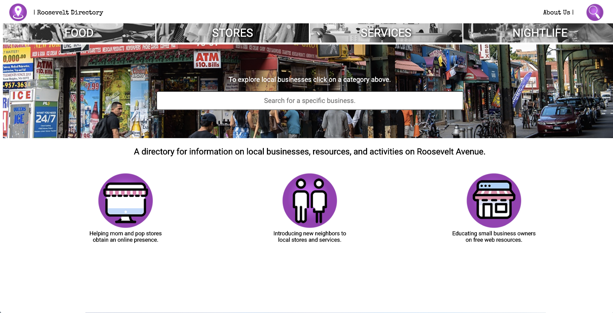

# RooseveltDirectory

A centralized location for information on local businesses, resources and activities on Roosevelt Avenue(in Jackson Heights).
The app aims to connect new community members to established local mom and pop businesses.  

Roosevelt Directory was built using HTML, CSS, javascript, Express, React and Axios. It also uses Google Maps Embed.



## Features

* Search businesses by name

## Features under construction

* Access businesses by category and subcategories
* Form for new businesses to sign-up to be part of the Roosevelt Directory
* Admin dashboard with controls to approve new businesses sign up
* Stores photos upload
* The home page show cases a new business every week with a blurb of the business(business story)

## Backend Endpoints & Functionality

| Method | Endpoint   | Params/Body     | Description                     |
| ------ | ---------- | --------------- | ------------------------------- |
| POST   | `/api/biz` | Business object | Adds a business to the database |

## DB Resources Operations & access patterns Draft

### Stores
1. Get single business by slug or id
```
GET /api/biz/:id
GET /api/biz/:slugified-name # Will need to be an index.
```
2. Search business by keywords or name
```
GET /api/biz?q=<keywords>
```

* Get Businesses by category or subcategory
```
GET /api/biz?categories[]=<cat1>&categories[]=<cat2>
GET /api/biz/category/:category
```

* Update a business category. Category as a subresource of a business?
```
PUT /api/biz/:id/categories/:category
DELETE /api/biz/:id/categories/:category
```
* Add a business schedule. Schedule as a subresource of a business
```
PUT /api/biz/:id/schedule/:dow
```
* Adding an object for a business, like uploading or removing images. Objects as subresource of businesses?
```
PUT /api/biz/:id/objects/:type
```

## Categories
* Get all main categories

```txt
GET /api/categories
```

* Get all subcategories from main category

```txt
GET /api/categories/:category/subcategories
```

* Get businesses by categories? With businesses as subresource of categories.
This makes sense because a category could be seen as a collection of businesses

```txt
GET /api/categories/:category/businesses
```
